<div align="center">
  
</div>

<div align="center">

<br/>


<br/><br/>

</div>

---

## Tentang Sistem

Berdasarkan hasil evaluasi pemilihan solusi pada Tabel 2.1 Matriks Evaluasi Terbobot di Milestone 2, kelompok kami menetapkan pengembangan Sistem QR-Ordering dan Kitchen Display System (KDS) Berbasis Cloud sebagai solusi terpilih dengan skor 4.00. Skor tertinggi ini diraih karena solusi tersebut dinilai paling unggul dalam aspek efisiensi biaya operasional dan kecepatan transmisi data pesanan secara real-time. Sistem ini dirancang secara khusus untuk menyelesaikan dua permasalahan utama: PR-01 (ketergantungan pada jumlah staf) diselesaikan melalui fitur self-ordering yang mengalihkan beban pengambilan pesanan langsung ke tangan pelanggan, sehingga restoran tetap beroperasi optimal meski kekurangan karyawan, dan PR-03 (sinkronisasi stok dan menu) diselesaikan melalui integrasi database cloud yang melakukan pengurangan stok secara otomatis (auto-decrement) setiap kali pesanan dikonfirmasi, memastikan pelanggan tidak dapat memesan menu yang sudah habis namun tetap memberikan fleksibilitas bagi koki untuk memperbarui stok secara manual jika terdapat perubahan suplai mendadak.

Sistem ini dibangun di atas platform Odoo 17 sebagai custom addon mandiri bernama `wasabi_kitchen_vanilla`. Addon mendefinisikan model-model tersendiri (bukan memperluas POS bawaan) sehingga seluruh logika bisnis, tampilan, dan keamanan sepenuhnya berada dalam satu modul. Alur kerja pesanan mengikuti state machine yang ketat: `pending` (pesanan masuk ke dapur), `cooking` (koki mulai memasak), `ready` (makanan siap disajikan), hingga `paid` (kasir mengonfirmasi pembayaran). Sistem juga mengimplementasikan RBAC penuh dengan empat role yang terisolasi masing-masing ke satu aplikasi tersendiri di Odoo, sehingga setiap aktor hanya dapat mengakses menu yang relevan dengan tanggung jawabnya.

---

## Fitur Utama

- **QR Ordering (UC-02, UC-03, UC-04)**
  Pelanggan dapat melakukan scan QR code di meja untuk melihat daftar menu yang tersedia beserta stok real-time. Menu ditampilkan dengan kode warna stok: merah (habis, tidak dapat dipesan), oranye (1 sampai 3 porsi tersisa, peringatan), hijau (4 porsi ke atas, aman). Staf juga dapat membuat pesanan baru dari backend melalui wizard form.

- **Kitchen Display System / Antrian Masak (UC-05, UC-09)**
  Koki melihat pesanan masuk dalam tampilan kanban 3 kolom berdasarkan status KDS (Pending, Cooking, Ready). Tombol transisi satu klik memungkinkan update status tanpa membuka form detail. Tampilan tree tersedia sebagai alternatif dengan filter dan pengelompokan per status.

- **Koreksi Stok Real-Time (UC-06)**
  Koki dapat melakukan koreksi stok manual melalui menu Kitchen Display. Perubahan langsung tersinkronisasi ke tampilan Browse Menu pelanggan sehingga item yang habis otomatis tidak dapat dipesan.

- **Billing dan Konfirmasi Pembayaran (UC-07, UC-10)**
  Kasir membuka wizard billing dari daftar pesanan berstatus Ready, memilih metode pembayaran (Cash atau QRIS), memasukkan nominal, dan sistem menghitung kembalian secara otomatis, termasuk PB1 10% dan service charge 5%. Pembayaran QRIS menampilkan QR code dinamis berbasis EMVCo yang di-generate langsung dari total transaksi. Kartu pesanan berstatus Paid dan Cancelled pada floor plan billing juga dapat dibuka untuk melihat ringkasan transaksi.

- **Laporan Transaksi dan Ekspor (UC-01, UC-08)**
  Manager dapat memfilter transaksi berdasarkan rentang tanggal, melihat ringkasan total pesanan dan total pendapatan, lalu mengunduh hasilnya dalam format CSV/XLSX.

- **RBAC dengan Aplikasi Terisolasi per Role**
  Setiap role memiliki satu aplikasi tersendiri di 9-dot Odoo (app switcher). Koki melihat Kitchen Display, kasir melihat Kasir, manager melihat Pelaporan, dan admin melihat Wasabi Kitchen (akses penuh via navbar dropdown). Tidak ada role yang dapat mengakses aplikasi milik role lain.

- **Otomasi Demo Data**
  Modul menyertakan `post_init_hook` yang otomatis membuat semua akun user per role, konfigurasi meja, 8 produk menu dengan stok awal, 6 draft order lintas semua status KDS, dan 155 transaksi terbayar bulan Mei 2026. Tidak diperlukan konfigurasi tambahan setelah instalasi.

---

## Tech Stack

| Layer | Teknologi |
|:---|:---|
| Platform | Odoo 17 (Community) |
| Backend Language | Python 3.11 |
| Database | PostgreSQL 16 |
| Containerization | Docker + Docker Compose |
| View Layer | Odoo XML Views (QWeb) |
| Module Dependencies | `base`, `web`, `product`, `portal` |
| Access Control | Odoo `res.groups` + `ir.rule` (record-level) |
| Data Seeding | Python `post_init_hook` via `__manifest__.py` |
| Export | Python `csv` module via Odoo `base64` file attachment |

---

## Screenshots

<div align="center">

| Dashboard (Admin) | KDS Kanban (Koki) | Billing Wizard (Kasir) |
|:---:|:---:|:---:|
|  |  |  |

| Laporan Transaksi (Manager) | Koreksi Stok (Koki) | Browse Menu (Pelanggan) |
|:---:|:---:|:---:|
| 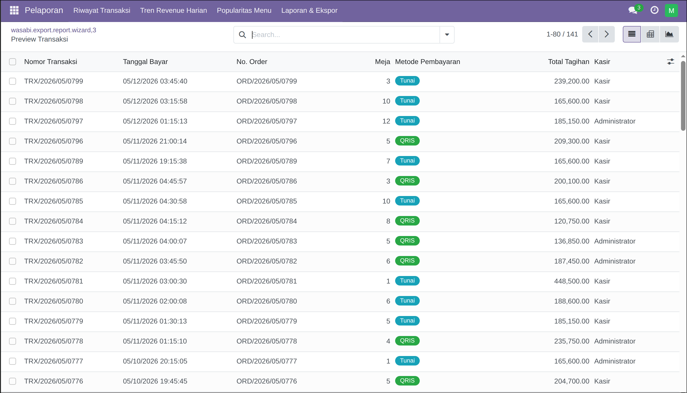 | 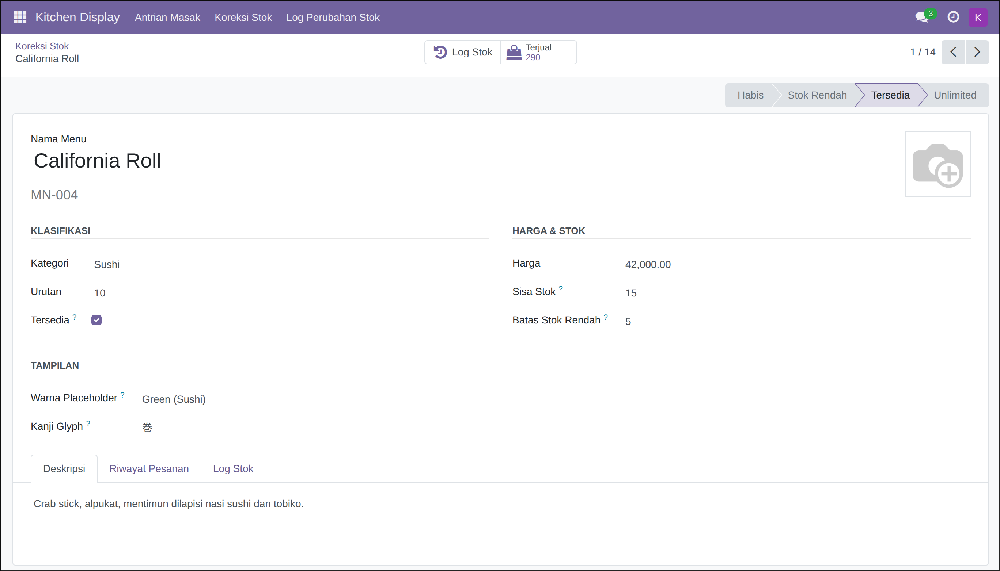 | 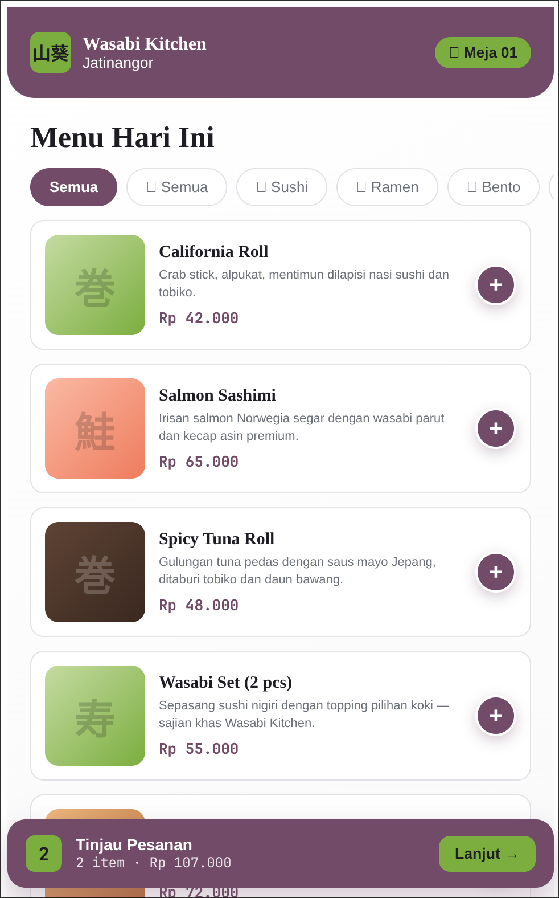 |

</div>

---

## Cara Menjalankan Sistem

> **Prasyarat:** Docker Desktop terinstal dan berjalan, Git tersedia di terminal.

### 1. Clone Repository

```bash
git clone <repo-url>
cd IF3141-odoo-K03-03
```

### 2. Build dan Jalankan Docker Compose

```bash
docker compose up --build -d
```

Perintah ini akan membangun image, menjalankan container `web` (Odoo) dan `db` (PostgreSQL), sekaligus menginstal modul `wasabi_kitchen_vanilla` secara otomatis. `post_init_hook` berjalan saat instalasi pertama dan langsung menyiapkan seluruh data demo berikut akun user per role.

Tunggu hingga kedua container berstatus `healthy`. Periksa dengan:

```bash
docker compose ps
```

<div align="center">
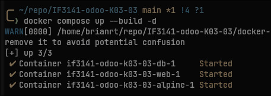
<br/><em>Container web dan db berjalan dengan status Up / healthy</em>
</div>

<br/>

### 3. Buka Browser dan Login

Akses `http://localhost:8069`, login dengan salah satu kredensial berikut sesuai role yang ingin diuji (lihat tabel Kredensial per Role di bawah).

<div align="center">
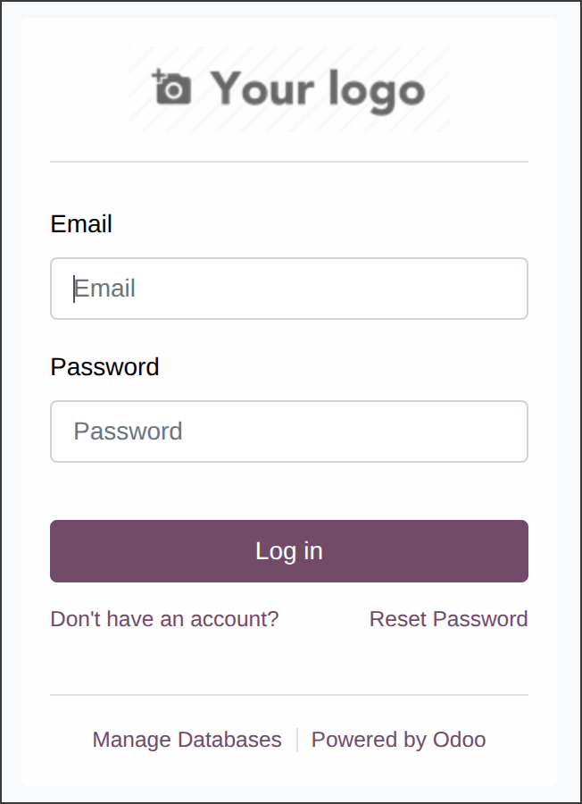
<br/><em>Halaman login Odoo, setelah login langsung diarahkan ke aplikasi sesuai role</em>
</div>

<br/>

### 4. Verifikasi Modul Terpasang (Login sebagai Admin)

Login dengan akun `admin / admin`, sistem langsung membuka Dashboard Wasabi Kitchen. Navbar atas menampilkan menu lengkap: Dashboard, Kitchen Display, Point of Sale, Master Data, dan Reports.

<div align="center">
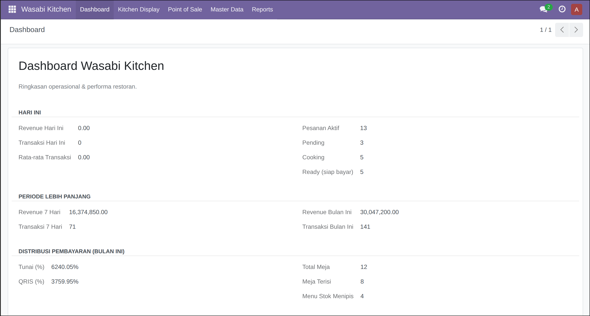
<br/><em>Navbar Wasabi Kitchen dengan dropdown lengkap setelah login sebagai Admin</em>
</div>

<br/>

### 5. Update Modul Setelah Perubahan (Development)

```bash
# Perubahan Python / XML / CSS (restart cukup)
docker compose restart web

# Perubahan model / field baru atau reset data demo
docker compose down -v
docker compose up --build -d
```

---

## Kredensial per Role

Sistem mengimplementasikan RBAC menggunakan Odoo security groups. Setiap role memiliki satu aplikasi tersendiri di 9-dot app switcher dan diarahkan otomatis ke halaman yang relevan setelah login. Seluruh akun dibuat otomatis oleh `post_init_hook` saat modul diinstal.

| Role | Username | Password | Aplikasi di 9-dot | Halaman Awal Setelah Login |
|:---|:---:|:---:|:---|:---|
| **Admin** | `admin` | `admin` | Wasabi Kitchen (full access) | Dashboard |
| **Manager** | `manager` | `manager` | Pelaporan | Riwayat Transaksi (Analitik) |
| **Koki** | `koki` | `koki` | Kitchen Display | Antrian Masak (KDS Kanban) |
| **Kasir** | `kasir` | `kasir` | Kasir | Buka Billing |
| **Pelanggan** | Tidak perlu login | | Tidak ada | Akses via URL QR meja |

> Pelanggan tidak memiliki akun Odoo. Akses dilakukan melalui URL QR code yang tertempel di meja fisik atau yang disimulasikan via menu Admin.

---

## Alur Per Role

### Pelanggan (Konsumen)

| | |
|:---|:---|
| **Akun** | Tidak diperlukan |
| **Akses** | URL QR code unik per meja |
| **Contoh URL** | `http://localhost:8069/wasabi/menu/<qr_token>` |

**Langkah:**

1. Pelanggan duduk di meja dan memindai QR code menggunakan kamera ponsel.
2. Browser membuka halaman Browse Menu tanpa login. Menu ditampilkan dengan stok real-time dan kode warna ketersediaan.
3. Pelanggan memilih item dan jumlah, lalu menekan **Pesan**.
4. Sistem membuat order baru dengan status `pending` dan mengirimkannya ke dapur (KDS).
5. Pelanggan menunggu makanan diantar. Status dapat dilihat kembali melalui URL yang sama.

<div align="center">

<br/><em>Halaman Browse Menu tanpa login, menu difilter otomatis berdasarkan stok tersedia</em>
</div>

---

### Koki

| | |
|:---|:---|
| **Login** | `koki` / `koki` |
| **Aplikasi di 9-dot** | Kitchen Display |
| **Halaman Awal** | Antrian Masak (KDS Kanban) |
| **Menu Tersedia** | Antrian Masak, Koreksi Stok, Log Perubahan Stok |

**Alur Antrian Masak (UC-05, UC-09):**

1. Login, sistem langsung membuka KDS Kanban dengan 3 kolom: **Pending**, **Cooking**, **Ready**.
2. Klik **Mulai Masak** pada kartu Meja 04 di kolom Pending. Kartu berpindah ke Cooking.
3. Setelah makanan selesai, klik **Tandai READY** pada kartu Meja 04. Kartu masuk ke kolom Ready dan siap diproses kasir.

**Alur Koreksi Stok (UC-06):**

1. Buka **Kitchen Display > Koreksi Stok**.
2. Pilih item menu, contoh: **Salmon Sashimi**, ubah stok dari 12 menjadi 5, lalu konfirmasi.
3. Stok diperbarui secara real-time. Item dengan stok 0 otomatis tidak muncul di Browse Menu pelanggan.

<div align="center">

| 1. KDS Kanban (Pending) | 2. Meja 04 Cooking | 3. Meja 04 Ready | 4. Koreksi Stok Salmon Sashimi |
|:---:|:---:|:---:|:---:|
| 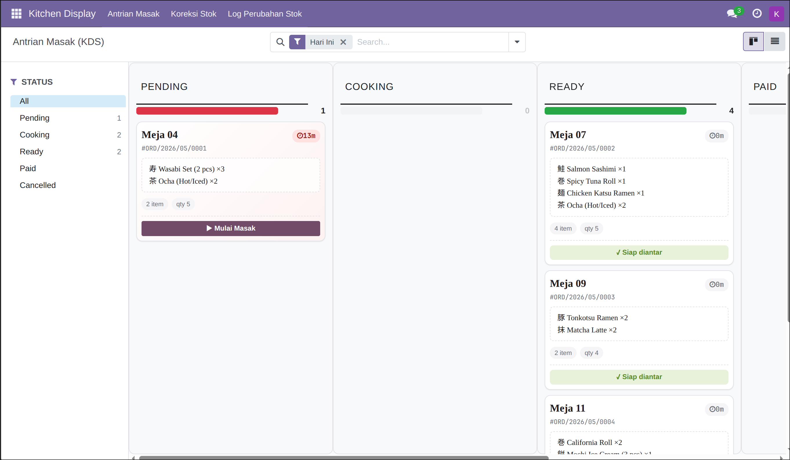 | 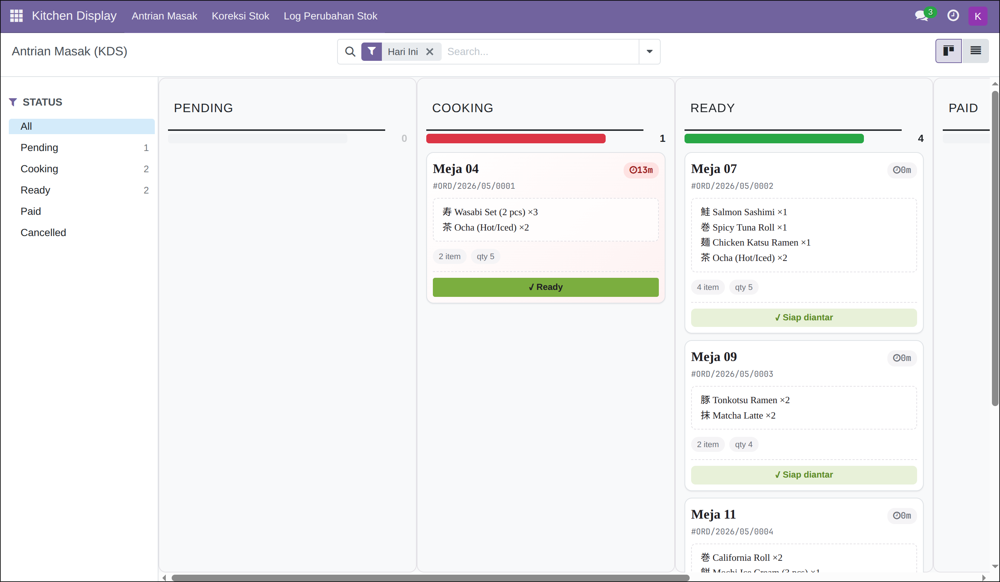 | 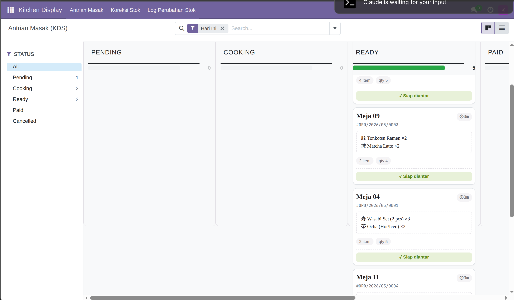 | 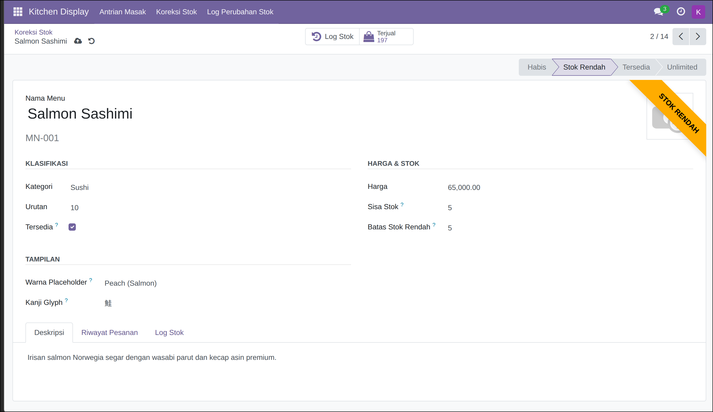 |

</div>

---

### Kasir

| | |
|:---|:---|
| **Login** | `kasir` / `kasir` |
| **Aplikasi di 9-dot** | Kasir |
| **Halaman Awal** | Buka Billing |
| **Menu Tersedia** | Buka Billing, Riwayat Transaksi |

**Alur Konfirmasi Pembayaran (UC-07, UC-10):**

1. Login, sistem langsung membuka daftar pesanan yang siap diproses.
2. Klik salah satu pesanan berstatus **Ready** untuk membuka wizard billing.
3. Wizard menampilkan ringkasan order: item, subtotal, PB1 10%, service charge 5%, dan total akhir.
4. Pilih metode pembayaran: **Cash** atau **QRIS**.
   - Cash: masukkan nominal yang dibayar, kembalian dihitung otomatis.
   - QRIS: tidak perlu input nominal tambahan.
5. Klik **Konfirmasi Pembayaran**. Status pesanan berubah menjadi `paid`, stok terpotong, transaksi tercatat.

<div align="center">

| 1. Daftar Billing | 2. Wizard Billing | 3. Pilih Metode Pembayaran | 4. Konfirmasi Selesai |
|:---:|:---:|:---:|:---:|
| 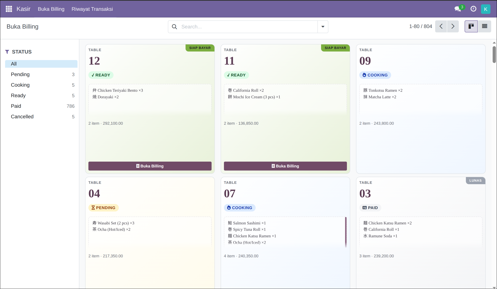 | 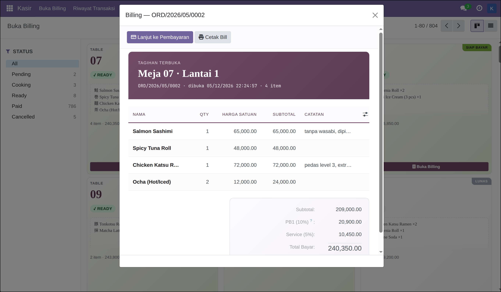 | 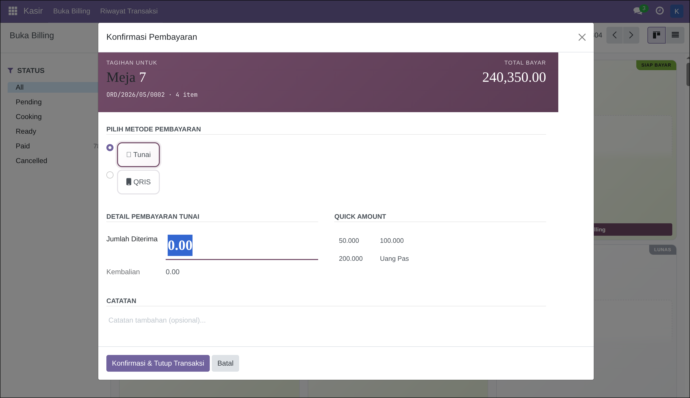 | 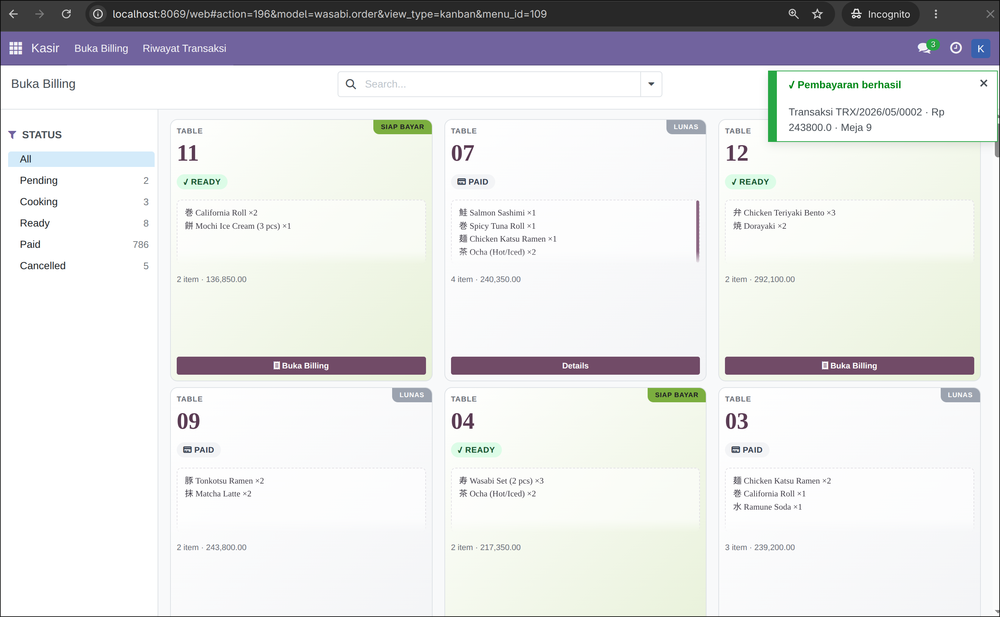 |

</div>

---

### Manager

| | |
|:---|:---|
| **Login** | `manager` / `manager` |
| **Aplikasi di 9-dot** | Pelaporan |
| **Halaman Awal** | Riwayat Transaksi (Analitik) |
| **Menu Tersedia** | Riwayat Transaksi, Tren Revenue Harian, Popularitas Menu, Laporan & Ekspor |

**Alur Query dan Ekspor Laporan (UC-01, UC-08):**

1. Login, sistem langsung membuka Riwayat Transaksi dalam bentuk bar chart per hari dengan seluruh transaksi `paid`.
2. Gunakan filter tanggal untuk mempersempit rentang, contoh: 01/05/2026 sampai 31/05/2026.
3. Buka **Pelaporan > Tren Revenue Harian** untuk melihat grafik total pendapatan per hari.
4. Buka **Pelaporan > Popularitas Menu** untuk melihat item yang paling banyak dipesan.
5. Buka **Pelaporan > Laporan & Ekspor**, pilih rentang tanggal dan format (CSV atau XLSX), klik **Ekspor**. File terunduh dengan kolom: Nomor Transaksi, Nomor Meja, Total (Rp), Metode Pembayaran, Timestamp.

<div align="center">

| 1. Riwayat Transaksi (Bar Chart) | 2. Tren Revenue Harian | 3. Popularitas Menu | 4. Ekspor Laporan |
|:---:|:---:|:---:|:---:|
| 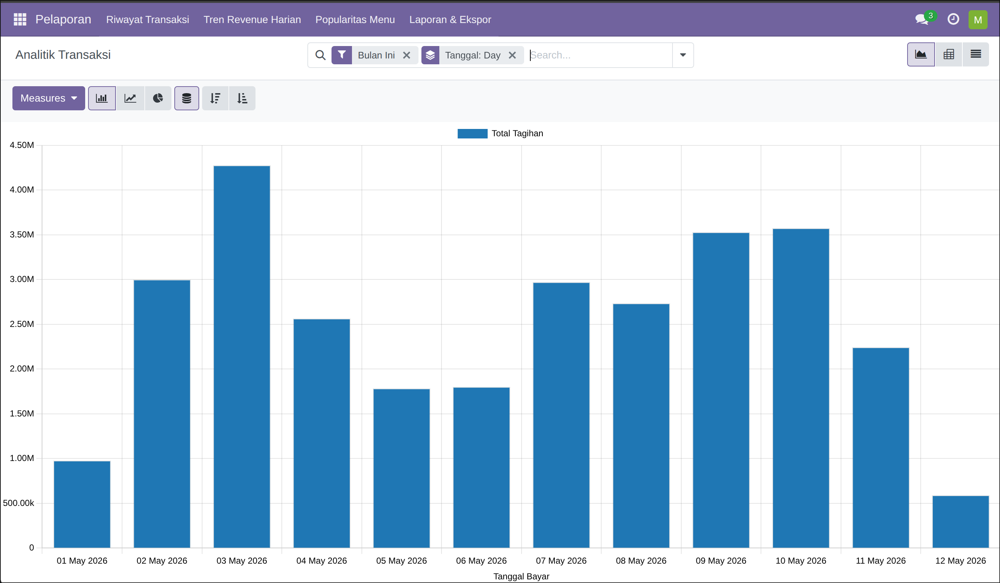 | 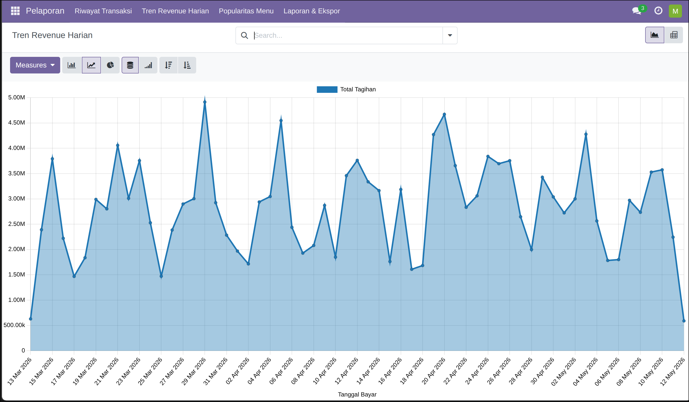 | 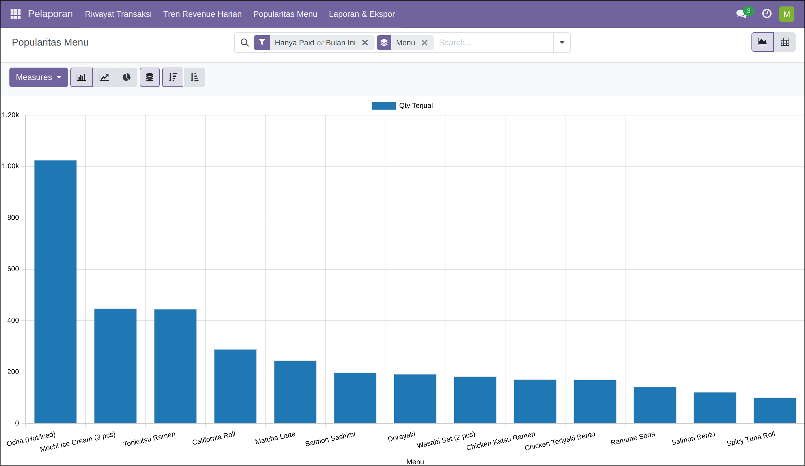 | 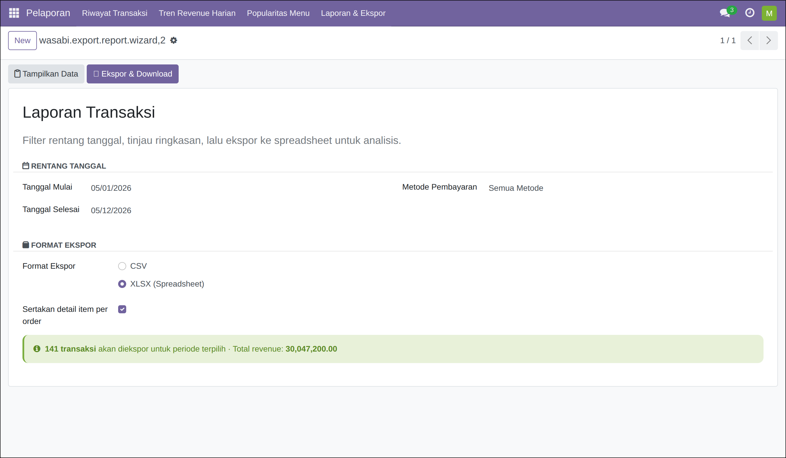 |

</div>

---

### Admin

| | |
|:---|:---|
| **Login** | `admin` / `admin` |
| **Aplikasi di 9-dot** | Wasabi Kitchen (satu-satunya, mencakup semua) |
| **Halaman Awal** | Dashboard |
| **Navbar** | Dashboard, Kitchen Display, Point of Sale, Master Data, Reports |

Admin memiliki akses penuh ke seluruh fitur melalui navbar dropdown sehingga tidak perlu berpindah ke 9-dot untuk mengakses area lain.

**Langkah:**

1. Login, sistem langsung membuka Dashboard Wasabi Kitchen dengan navbar aktif.
2. **Kitchen Display**: pantau KDS, koreksi stok, lihat log perubahan stok.
3. **Point of Sale**: buka billing, lihat riwayat transaksi.
4. **Master Data**: kelola menu & stok, kategori, dan data meja restoran.
5. **Reports**: akses semua laporan analitik dan ekspor data (sama seperti role Manager).

<div align="center">

| 1. Dashboard | 2. KDS via Navbar |
|:---:|:---:|
|  | 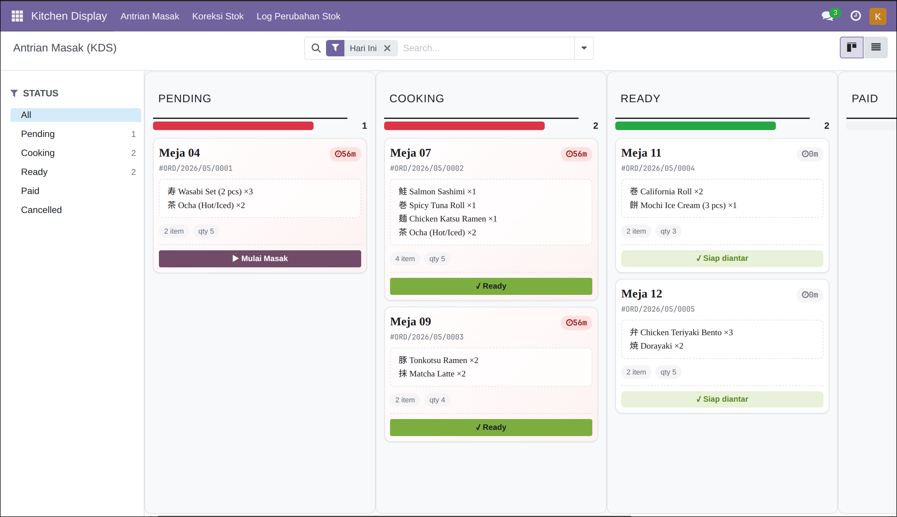 |

</div>

**Master Data - Menu & Stok:**

Halaman Master Data dibuka dengan tampilan hub kategori. Klik salah satu kategori untuk melihat item menu di dalamnya. Kategori **Semua** menampilkan seluruh item lintas kategori, dikelompokkan per kategori (group by category).

<div align="center">

| 3. Hub Kategori | 4. Item Menu (Group by Category) |
|:---:|:---:|
| 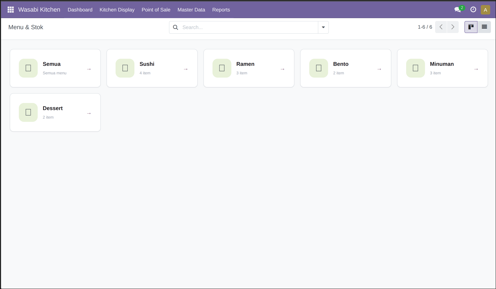 | 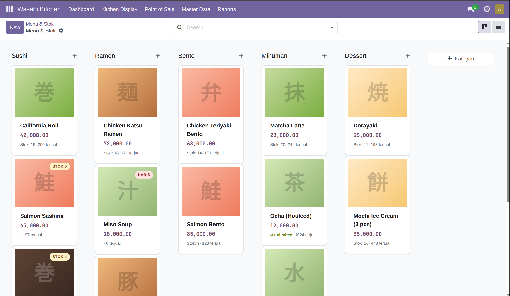 |

</div>

<br/>

---

## Database Migration (Antar Anggota Tim)

Odoo menggunakan local database pada implementasinya. Untuk berbagi state database antar anggota tim, gunakan script export atau import pada folder `scripts`. Selalu matikan service terlebih dahulu sebelum migration:

```bash
docker compose down
```

**Export (setelah membuat perubahan data):**

| OS | Command |
|:---|:---|
| macOS / Linux | `./scripts/export_db.sh` |
| Windows | `scripts\export_db.cmd` |

**Import (mengambil perubahan dari rekan tim):**

| OS | Command |
|:---|:---|
| macOS / Linux | `./scripts/import_db.sh` |
| Windows | `scripts\import_db.cmd` |

---

## Struktur Proyek

```
IF3141-odoo-K03-03/
├── docker-compose.yml
├── config/
│   └── odoo.conf
├── scripts/
├── dump/
└── custom_addons/
    └── wasabi_kitchen_vanilla/
        ├── __manifest__.py
        ├── hooks.py
        ├── models/
        │   ├── wasabi_category.py
        │   ├── wasabi_menu_item.py
        │   ├── wasabi_table.py
        │   ├── wasabi_order.py
        │   ├── wasabi_order_item.py
        │   ├── wasabi_transaction.py
        │   ├── wasabi_stock_log.py
        │   └── wasabi_dashboard.py
        ├── views/
        │   ├── kds_views.xml
        │   ├── order_views.xml
        │   ├── billing_views.xml
        │   ├── payment_wizard_views.xml
        │   ├── qr_preview_wizard_views.xml
        │   ├── menu_item_views.xml
        │   ├── category_views.xml
        │   ├── table_views.xml
        │   ├── transaction_views.xml
        │   ├── stock_log_views.xml
        │   ├── dashboard_views.xml
        │   ├── analytics_views.xml
        │   ├── export_report_wizard_views.xml
        │   └── wasabi_menu.xml
        ├── report/
        │   └── billing_report.xml
        ├── data/
        │   ├── wasabi_sequence.xml
        │   └── wasabi_demo_data.xml
        ├── security/
        │   ├── wasabi_security.xml
        │   └── ir.model.access.csv
        └── static/
            ├── description/
            └── src/
                ├── css/
                ├── js/
                └── xml/
```

---

## Kesimpulan dan Saran

Sistem QR-Ordering dan Kitchen Display System Wasabi Kitchen berhasil diimplementasikan sebagai custom addon Odoo 17 yang mandiri, mencakup alur pesanan end-to-end mulai dari pemindaian QR oleh pelanggan hingga konfirmasi pembayaran oleh kasir dan ekspor laporan oleh manager. RBAC telah diimplementasikan menggunakan Odoo security groups dengan empat role terisolasi: setiap aktor hanya melihat satu aplikasi di app switcher dan diarahkan otomatis ke halaman yang relevan setelah login, sehingga tidak ada celah navigasi antar role melalui URL manual pun. State machine yang ketat (pending, cooking, ready, paid), mekanisme auto-decrement stok, dan 155 transaksi demo yang disertakan menjadikan sistem dapat langsung didemonstrasikan tanpa konfigurasi tambahan setelah `docker compose up --build`.

Untuk pengembangan lebih lanjut, disarankan beberapa hal: pertama, integrasikan payment gateway nyata untuk metode QRIS agar transaksi non-tunai dapat diverifikasi secara otomatis tanpa input manual kasir, kedua, tambahkan Odoo Bus atau WebSocket push agar KDS di layar koki ter-refresh otomatis sehingga koki tidak perlu reload manual untuk melihat pesanan baru masuk, ketiga, perkuat validasi stok di sisi frontend Browse Menu agar quantity selector langsung dibatasi sesuai sisa stok tanpa menunggu error dari server, dan keempat, tambahkan dekorator `@api.depends` pada field computed `active_orders_count` di model meja agar hitungan pesanan aktif diperbarui secara reaktif tanpa reload halaman.

---

## Authors

<div align="center">

| NIM | Nama |
|:---:|:---|
| 13523126 | Brian Ricardo Tamin |
| 13523133 | Rafa Abdussalam Danadyaksa |
| 13523151 | Ardell Aghna Mahendra |
| 13523154 | Theo Kurniady |
| 13523163 | Filbert Engyo |

</div>

---

<div align="center">
  
</div>
